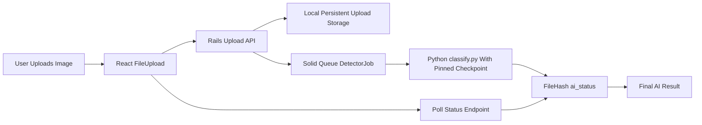
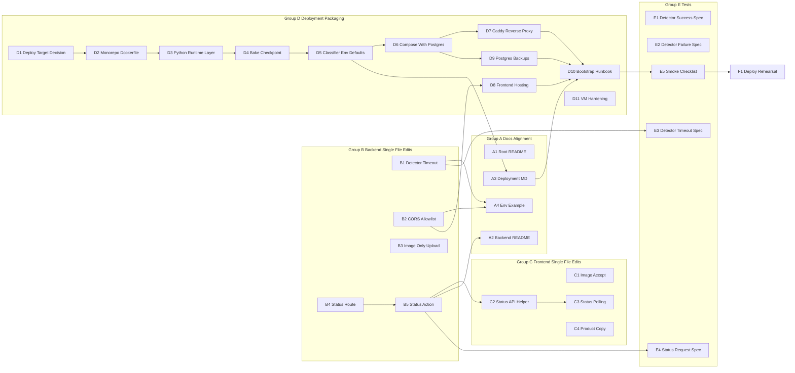

# CounterAI MVP Launch Plan

> Living checklist. Mark `[x]` as you complete each card. Each card is sized for a single bounded change so it can be picked up independently.

## Current Starting Point

The model decision is no longer the launch blocker. The promoted checkpoint is the Phase G6 seed 42 EfficientNet-V2-S model documented in [`model/docs/MODEL_ABLATION_PLAN.md`](model/docs/MODEL_ABLATION_PLAN.md), and [`backend/app/jobs/detector_job.rb`](backend/app/jobs/detector_job.rb) already pins `best_real_fake_20260422_002356_seed42.pt` through `CLASSIFIER_CHECKPOINT`.

**Status (implemented in repo):** B/C/A/E tracks and Compose-first Dockerfile path are coded and tested (`bundle exec rspec spec/jobs spec/requests`; `pnpm exec tsc -b`). **Remaining before “launched” in production:** place the pinned checkpoint under `model/artifacts/`, run **`F1`** (smoke/rehearsal on real hardware), optionally complete **`D9`** (automated backups + restore drill) and **`D11`** (host hardening) on the VM.

**As-implemented deltas vs original card wording (quick reference):**

- **B4 / routes:** `GET`/`OPTIONS` `file_hashes/:hash` match any segment; **`#show`** enforces `\A[a-f0-9]{64}\z` and returns **400** for invalid hash (no regex-only routing).
- **B1:** timeout reads **`DetectorJob.classifier_timeout_sec`** per call (`ENV["CLASSIFIER_TIMEOUT_SEC"]`), not a class-level frozen constant.
- **Ruby image paths:** Dockerfile copies **`model/` → `/model`** in the runtime image (`CLASSIFIER_SCRIPT` / **`CLASSIFIER_CHECKPOINT`** defaults use `/model/...`, not `/opt/counterai/model`).
- **Tests:** `spec/rails_helper.rb` sets **`ActiveJob::Base.queue_adapter = :test`** so `perform_later` does not require Solid Queue DB setup during request specs.
- **Compose:** **`web`** publishes **`8080:80`**; Caddy lives at **`deploy/caddy/Caddyfile`** with Compose profile **`tls`**.

## MVP Definition

Launch is ready when a real user can upload a supported image from the deployed frontend, the deployed backend stores it, the job worker runs the pinned checkpoint, and the frontend shows a final `ai_detected` or `ai_not_detected` result without requiring a second upload.

Phase H (`scratch_cnn_v1`) is not part of the MVP gate. Keep it as post-launch research.

## Security Review Notes

This MVP is a public file-upload application that runs an ML classifier over user-supplied bytes. The most important pre-launch security risks are:

- **Abuse and cost control:** unauthenticated uploads can be spammed; add rate limiting before opening the app beyond a controlled MVP audience.
- **File safety:** client-side `accept="image/*"` is only UX. Backend validation must enforce type and size, and the classifier must keep timeout/error handling.
- **CORS:** never use `*` with this API. Only echo origins from `FRONTEND_ORIGINS`.
- **Secrets:** `.env`, `RAILS_MASTER_KEY`, database passwords, backup credentials, and object-store keys must stay off git and out of logs.
- **Supply chain:** pin or checksum Python dependencies and the model checkpoint before relying on a production image.
- **Operational recovery:** backups must be encrypted/off-host and restore-tested before launch.

Smaller-model executors should preserve these notes when editing a card. If a card offers a permissive shortcut, choose the stricter option unless the user explicitly approves the risk.

**Security caveat not yet modeled as a core MVP card:** this plan still assumes a controlled MVP audience. Before a fully public launch, add rate limiting (for example Rack::Attack or reverse-proxy limits) on `POST /file_hashes/upload`, `POST /file_hashes/check`, and `GET /file_hashes/:hash`; consider authentication or invite-only access if abuse/cost exposure matters. CORS does not prevent server-side abuse.

## Architecture

## Dependency Graph

## Progress Summary

- [x] **Wave 1** — B1, B2, B3, B4, C1, C4, D1, E1 (**D11** ops still open on host)
- [x] **Wave 2** — B5, C2, D2, D8, E2, E3
- [x] **Wave 3** — C3, D3, E4
- [x] **Wave 4** — D4, D5, A1, A2
- [x] **Wave 5** — D6, A3, A4
- [x] **Wave 6** — D7 (**D9** backup automation + restore drill still open)
- [x] **Wave 7** — D10 essentials + E5 (**D10**: full prose checklist stays below; **`DEPLOYMENT.md`** duplicates the runnable slice)
- [ ] **Wave 8** — F1 (**manual**: run on target host with real `.env`, checkpoint present, HTTPS if using Caddy)

---

## Group B: Backend single-file edits

### - [x] B1: Detector subprocess timeout

- **Inputs:** [`backend/app/jobs/detector_job.rb`](backend/app/jobs/detector_job.rb).
- **Output (`DetectorJob`):** wrap `Open3.capture3` with `Timeout.timeout(classifier_timeout_sec)` where **`classifier_timeout_sec`** reads `ENV.fetch("CLASSIFIER_TIMEOUT_SEC", "60")`; rescue **`Timeout::Error`**; keep `unknown` **ai_status**.
- **Security note for executor:** do not log raw classifier stdout, full stderr, secrets, or env values. Log enough to debug (`hash_value`, basename of checkpoint, timeout, exit code) without leaking local paths beyond what is operationally necessary.
- **Acceptance:** `bundle exec rspec spec/jobs/detector_job_spec.rb` passes (after E3); manual: a stubbed sleep longer than the env value returns from the job in under timeout + 2s and leaves the record `unknown`.
- **Dependencies:** none.

### - [x] B2: CORS allowlist via `FRONTEND_ORIGINS`

- **Inputs:** [`backend/app/controllers/file_hashes_controller.rb`](backend/app/controllers/file_hashes_controller.rb).
- **Output:** same file. Replace the hardcoded `allowed_origins` array in `set_cors_headers` with `ENV.fetch("FRONTEND_ORIGINS", "").split(",").map(&:strip).reject(&:blank?)`; in development also keep `http://localhost:5173` and `http://127.0.0.1:5173`. Echo the matched origin only.
- **Security note for executor:** do not fall back to `*`, do not allow arbitrary origins in production, and do not treat missing `FRONTEND_ORIGINS` as "allow all". CORS is not authentication; it only controls browser access.
- **Acceptance:** with `FRONTEND_ORIGINS=https://example.com` set, a request from `https://example.com` receives the matching `Access-Control-Allow-Origin`; an unknown origin gets no ACAO header.
- **Dependencies:** none.

### - [x] B3: Image-only upload validation

- **Inputs:** [`backend/app/controllers/file_hashes_controller.rb`](backend/app/controllers/file_hashes_controller.rb).
- **Output:** same file. In `#upload`, after the size check, reject when `file.content_type` is not in `%w[image/jpeg image/png image/webp image/gif]` with `render json: { error: "unsupported file type" }, status: :unsupported_media_type` (415).
- **Security note for executor:** browser-provided MIME types can be spoofed. For MVP, combine content-type checks with extension allowlisting and keep the existing 25MB cap; post-MVP, prefer magic-byte sniffing with Marcel or a similar library. Do not add SVG support unless it is sanitized, since SVG can carry active content.
- **Acceptance:** PNG upload still succeeds; PDF or video upload returns 415.
- **Dependencies:** none.

### - [x] B4: Status route

- **Inputs:** [`backend/config/routes.rb`](backend/config/routes.rb).
- **Output (design intent):** add `GET`/`OPTIONS` for `file_hashes/:hash` (exactly one path segment).
- **As implemented:** unconstrained `:hash`; validation lives in **`#show`** (`\A[a-f0-9]{64}\z`, else **400** `invalid hash`).
- **Implementation note:** routes accept any `:hash`; [`file_hashes_controller.rb`](backend/app/controllers/file_hashes_controller.rb) `#show` validates lowercase SHA-256 hex.
- **Security note for executor:** keep the 64-character lowercase hex constraint. Do not add a broad `:hash` route that accepts slashes or arbitrary strings.
- **Acceptance:** `bin/rails routes | grep file_hashes` shows the new GET and OPTIONS routes.
- **Dependencies:** none.

### - [x] B5: Status action

- **Inputs:** [`backend/app/controllers/file_hashes_controller.rb`](backend/app/controllers/file_hashes_controller.rb), [`backend/app/models/file_hash.rb`](backend/app/models/file_hash.rb).
- **Output:** add `#show` to the controller. If the record exists, render `{ hash:, found_in_database: true, ai_status: }`. If missing, render `{ hash:, found_in_database: false, ai_status: "unknown" }` with status 404. Reuse `set_cors_headers`.
- **Security note for executor:** return only status metadata. Do not expose `saved_at`, original filename, upload path, DB IDs, timestamps, or classifier logs from this endpoint. SHA-256 hashes are high entropy, but this is still a public lookup surface.
- **Acceptance:** `curl /file_hashes/<known>` returns 200 with current `ai_status`; unknown hash returns 404.
- **Dependencies:** B4.

---

## Group C: Frontend single-file edits

### - [x] C1: Image-only client validation

- **Inputs:** [`frontend/src/components/FileUpload.tsx`](frontend/src/components/FileUpload.tsx).
- **Output:** same file. Add `accept="image/*"` to the `<input type="file">`. In `handleFileChange`, if `selectedFile.type` does not start with `image/`, set the same error UX path as the size check.
- **Security note for executor:** this is only a UX guard. Keep backend validation as the source of truth, and do not loosen B3 because this client check exists.
- **Acceptance:** file picker filters to images; selecting a `.pdf` shows an inline error and disables submit.
- **Dependencies:** none.

### - [x] C2: Status API helper

- **Inputs:** [`frontend/src/services/api.ts`](frontend/src/services/api.ts).
- **Output:** same file. Export `fetchFileHashStatus(hash: string): Promise<{ hash: string; found_in_database: boolean; ai_status: AiStatus }>` that calls `GET /file_hashes/:hash`. Reuse the existing error shape.
- **Security note for executor:** validate the hash client-side before interpolating it into the URL (`/^[a-f0-9]{64}$/`). Use `encodeURIComponent(hash)` even after validation.
- **Acceptance:** TypeScript builds; helper returns typed shape on a known hash.
- **Dependencies:** B5.

### - [x] C3: Status polling in upload UI

- **Inputs:** [`frontend/src/components/FileUpload.tsx`](frontend/src/components/FileUpload.tsx), [`frontend/src/services/api.ts`](frontend/src/services/api.ts).
- **Output:** only `FileUpload.tsx`. After upload, if `result.ai_status === "unknown"`, render `Processing...` and call `fetchFileHashStatus(result.hash)` every 2 seconds for up to 60 seconds; stop on a non-`unknown` status and update result. On timeout, render a soft error stating detection is still pending. Cancel polling on unmount.
- **Security note for executor:** use a fixed polling cap and cancel timers on unmount to avoid runaway browser traffic. Do not poll faster than every 2 seconds for MVP.
- **Acceptance:** end-to-end test: a fresh upload transitions from `Processing...` to a final label without a second submit.
- **Dependencies:** C2.

### - [x] C4: Product copy: images only

- **Inputs:** [`frontend/src/components/FileUpload.tsx`](frontend/src/components/FileUpload.tsx), [`frontend/src/components/DataCollectionBanner.tsx`](frontend/src/components/DataCollectionBanner.tsx), [`frontend/src/App.tsx`](frontend/src/App.tsx), [`README.md`](README.md).
- **Output:** replace user-visible copy that promises video support (for example "photographs and videos") with image-only language. Do not touch English copy in the model docs.
- **Acceptance:** search for `video` across `frontend/src/**` and the root README returns no user-facing promise of video support.
- **Dependencies:** none.

---

## Group D: Deployment packaging

### - [x] D1: Deploy target decision

- **Inputs:** [`DEPLOYMENT.md`](DEPLOYMENT.md), [`backend/Dockerfile`](backend/Dockerfile), [`backend/config/deploy.yml`](backend/config/deploy.yml).
- **Output:** a short "MVP deploy target" section in `DEPLOYMENT.md` declaring the chosen path (single-host Docker recommended) and listing the rejected alternatives (Heroku subdir buildpack, Kamal split web/worker) with one-line reasons.
- **Acceptance:** a reader can pick exactly one path without rereading other docs.
- **Dependencies:** none.

### - [x] D2: Monorepo Dockerfile

- **Inputs:** [`backend/Dockerfile`](backend/Dockerfile), [`model/`](model/).
- **Output:** add a new `Dockerfile` at repo root (or `backend/Dockerfile.mvp`) that uses build context = repo root and `COPY backend ./backend` plus `COPY model ./model` (only inference subset). Keep the existing Ruby base and gem install.
- **Security note for executor:** do not `COPY . .` from the repo root unless `.dockerignore` excludes `.env`, `backend/config/master.key`, datasets, notebooks, training outputs, git metadata, and any raw uploads. Prefer explicit `COPY backend` plus an inference-only subset of `model`.
- **Acceptance:** `docker build -t counterai-mvp .` from the repo root succeeds.
- **Dependencies:** D1.

### - [x] D3: Python runtime layer

- **Inputs:** the new Dockerfile from D2, [`model/`](model/) (look for an existing `requirements.txt`).
- **Output:** install `python3`, `python3-venv`, and `python3-pip`; create a venv at `/opt/counterai/.venv`; `pip install --no-cache-dir -r model/requirements-inference.txt` (create a minimal inference-only file if one does not exist; CPU torch + Pillow + numpy are the expected deps based on `classify.py`).
- **Security note for executor:** prefer pinned exact versions in `requirements-inference.txt` for the production image. Do not install training-only packages if inference does not need them. Use `--no-cache-dir` and avoid running pip as the final app user.
- **Acceptance:** built image has `/opt/counterai/.venv/bin/python -c "import torch, PIL"` exiting 0.
- **Dependencies:** D2.

### - [x] D4: Bake checkpoint into image

- **Inputs:** root [`Dockerfile`](Dockerfile) and **`model/`** tree (pinned file under **`model/artifacts/`**).
- **As implemented:** `COPY model/ /model/` brings code + **`model/artifacts/best_real_fake_20260422_002356_seed42.pt`** together; omitting that file breaks the Docker build / runtime.
- **Security note for executor:** record the checkpoint SHA-256 in `DEPLOYMENT.md` and verify it at build or startup. Treat the checkpoint as executable-adjacent supply-chain material because PyTorch checkpoints are deserialized by Python.
- **Acceptance:** `docker compose build` succeeds once the pinned `.pt` exists; running the web image shows **`/model/artifacts/`** contains the pinned filename (`docker run … ls /model/artifacts/`).
- **Dependencies:** D3.

### - [x] D5: Classifier env defaults

- **Implementation note (`Dockerfile`):** `ENV CLASSIFIER_PYTHON=/opt/counterai/.venv/bin/python CLASSIFIER_SCRIPT=/model/classify.py CLASSIFIER_CHECKPOINT=/model/artifacts/best_real_fake_20260422_002356_seed42.pt CLASSIFIER_DEVICE=cpu CLASSIFIER_TIMEOUT_SEC=60` (Rails still resolves **`../model`** to **`/model`** when `MODEL_ROOT` is unchanged).
- **Inputs:** root [`Dockerfile`](Dockerfile).
- **Security note for executor:** image defaults may include paths, but not secrets. Keep `RAILS_MASTER_KEY`, database credentials, backup credentials, and Caddy account email in runtime env or host config, never in the Dockerfile.
- **Acceptance:** a fresh container starts the Rails app and `DetectorJob` resolves all four constants without override env.
- **Dependencies:** D4.

### - [x] D6: docker-compose.yml with Postgres service

- **Implementation note:** Caddy mounts **`deploy/caddy/Caddyfile`**; Compose profile **`tls`**. **`web`** publishes **`8080:80`** for local HTTP smoke without Caddy.
- **Inputs:** the Dockerfile from D2–D5, [`backend/config/database.yml`](backend/config/database.yml), [`.env.example`](.env.example).
- **Output:** new `docker-compose.yml` at the repo root with:
  - `web`: builds from the new Dockerfile, `env_file: .env`, `depends_on: db` (with `condition: service_healthy`), healthcheck `curl -f http://localhost:80/up`, mounts `uploads:/rails/storage/uploads`.
  - `db`: `postgres:16-alpine`, env from `POSTGRES_USER`, `POSTGRES_PASSWORD`, `POSTGRES_DB`, named volume `postgres-data:/var/lib/postgresql/data`, healthcheck `pg_isready -U $POSTGRES_USER -d $POSTGRES_DB`.
  - **Caddy (`tls` profile):** `./deploy/caddy/Caddyfile` plus volumes `caddy-data`, `caddy-config`.
  - Top-level volumes: `postgres-data`, `uploads`, `caddy-data`, `caddy-config`.
  - In `.env`, set `DATABASE_URL=postgres://${POSTGRES_USER}:${POSTGRES_PASSWORD}@db:5432/${POSTGRES_DB}` and `RAILS_MAX_THREADS` to match the Puma thread count so Solid Queue does not starve the connection pool.
- **Security note for executor:** do not publish Postgres to the public internet. The `db` service should have no `ports:` block; only internal Docker networking should reach it. Add `restart: unless-stopped` and run the Rails container as a non-root user if the Dockerfile does not already do so.
- **Acceptance:** smoke **`curl http://127.0.0.1:8080/up`** locally; HTTPS path via Caddy **`https://${API_HOST}/up`** when profile **`tls`** is up (after DNS propagates).
- **Dependencies:** D5.

### - [x] D7: Caddy reverse proxy with automatic TLS

- **Implementation note:** **`caddy:2-alpine`**; Let’s Encrypt is automatic once **`API_HOST`** DNS points at the host and profile **`tls`** is enabled.
- **Inputs:** `docker-compose.yml` from D6, an `API_HOST` value, DNS pointing at the host.
- **Output:** add `caddy/Caddyfile` (mounted into the `caddy` service) reverse-proxying `${API_HOST}` to `web:80`. Use `tls you@your-domain` so Let's Encrypt issues a cert automatically. Optionally serve the frontend `dist/` via `file_server` if D8 chooses the same-Caddy path.
- **Security note for executor:** enable HTTPS-only behavior and add basic security headers (`Strict-Transport-Security`, `X-Content-Type-Options`, `Referrer-Policy`). Do not expose Rails directly on a public host port if Caddy is the intended public entrypoint.
- **Acceptance:** `https://${API_HOST}/up` with valid Let’s Encrypt cert once DNS + **`tls`** profile are wired (automatic TLS for `{$API_HOST}` in Caddyfile).
- **Dependencies:** D6.

### - [x] D8: Frontend hosting decision

- **Implementation note:** **`DEPLOYMENT.md`** documents **external static host** (`pnpm build` + `VITE_API_BASE_URL`) as the default Compose story; **`FRONTEND_ORIGINS`** on Rails must list that origin. Same-Caddy `file_server` for `frontend/dist/` is optional and **not** wired in compose automatically.
- **Inputs:** [`frontend/`](frontend/), [`DEPLOYMENT.md`](DEPLOYMENT.md), B2 (`FRONTEND_ORIGINS`).
- **Output:** decide and document one of the following in `DEPLOYMENT.md`:
  - **Same Caddy** serves `frontend/dist/` from a `file_server` directive (lowest ops, one host).
  - **External static host** (Cloudflare Pages, Netlify, or Vercel), built with `VITE_API_BASE_URL=https://${API_HOST}`.
  Either way, set `FRONTEND_ORIGINS` to the comma-separated list of origins the frontend will be served from. Update [`README.md`](README.md) "Deploying" to point at the chosen path.
- **Security note for executor:** if using an external static host, set `FRONTEND_ORIGINS` to the final production origin only, not preview URLs. If preview deploys need API access, add them temporarily and remove them after testing.
- **Acceptance:** the deployed frontend can call the deployed API without CORS errors and over HTTPS.
- **Dependencies:** B2.

### - [ ] D9: Postgres backup strategy

- **Inputs:** D6 `docker-compose.yml`.
- **Output:** a host-side cron entry that runs nightly `docker compose -f /opt/counterai/docker-compose.yml exec -T db pg_dump -U $POSTGRES_USER -F c $POSTGRES_DB | gzip > /backup/$(date -u +%FT%H%M).dump.gz`, then rsyncs `/backup/` to off-host storage (S3 / B2 / R2 / managed snapshots) and prunes anything older than 14 days. Document the matching restore command (`pg_restore -d ... < dump`) in `DEPLOYMENT.md` and run a one-time restore drill into a throwaway DB.
- **Security note for executor:** backups contain user-upload metadata and possibly sensitive operational data. Encrypt backups before off-host transfer, restrict backup file permissions to root or a dedicated backup user, and never commit backup credentials to the repo.
- **Acceptance:** one successful nightly backup file lands in off-host storage; one successful restore drill into a fresh `counterai_restore` database recovers a known row.
- **Dependencies:** D6.

### - [x] D10: First-deploy bootstrap runbook

- **Implementation note:** runnable compose + Postgres + **`db:prepare`** + **`/up`** + smoke bullets live in **`DEPLOYMENT.md`**. Items 1–7 below remain the fuller narrative checklist; **`deploy/env.docker.example`** templates env vars — copy to repo-root `.env`.
- **Inputs:** [`DEPLOYMENT.md`](DEPLOYMENT.md), Compose stack **D6**–**D8**, **`A3`**. Automated backups (**D9**) still recommended before calling production “done.”
- **Output:** an ordered checklist appended to `DEPLOYMENT.md`:
  1. Provision VM (Ubuntu LTS, 2–4 GB RAM, Docker installed); point DNS A record at the host.
  2. Clone repo to `/opt/counterai`.
  3. Copy `.env` with `RAILS_MASTER_KEY`, `POSTGRES_USER`, `POSTGRES_PASSWORD`, `POSTGRES_DB`, `DATABASE_URL`, `CLASSIFIER_*`, `CLASSIFIER_TIMEOUT_SEC`, `FRONTEND_ORIGINS`, `RAILS_MAX_THREADS`, `API_HOST`.
  4. `docker compose build && docker compose up -d`.
  5. `docker compose run --rm web bin/rails db:prepare` (runs all four migration paths).
  6. Verify `https://${API_HOST}/up` returns 200 and that Caddy fetched a cert.
  7. Verify a sample upload via `curl` reaches `ai_status: ai_detected` or `ai_not_detected` within the polling window.
- **Security note for executor:** the runbook must say `.env` permissions should be `chmod 600`, `backend/config/master.key` must not be copied into the repo on the server unless intentionally managed that way, and deploy logs must not print `DATABASE_URL` or `RAILS_MASTER_KEY`.
- **Acceptance:** a fresh operator can follow the runbook end-to-end and reach a green deployment without prior tribal knowledge.
- **Dependencies:** D6–D8, **A3** (original card also listed **D9** — backup automation remains open as **D9**).

### - [ ] D11: VM hardening

- **Inputs:** the host VM, [`DEPLOYMENT.md`](DEPLOYMENT.md).
- **Output:** documented in `DEPLOYMENT.md` and applied on the host:
  - SSH key-only authentication (`PasswordAuthentication no`, `PermitRootLogin prohibit-password` or `no`).
  - UFW: `default deny incoming`, allow `22/tcp`, `80/tcp`, `443/tcp`; `default allow outgoing`.
  - Optional: `fail2ban` with the default `sshd` jail.
  - Unattended security upgrades enabled (`unattended-upgrades`).
- **Acceptance:** `ssh root@host` with a password fails; an external `nmap` shows only 22, 80, and 443 open; `unattended-upgrades --dry-run` reports a configured policy.
- **Dependencies:** none (host-level concern; can run any time before F1).

---

## Group A: Docs alignment

### - [x] A1: Root README current status

- **Inputs:** [`README.md`](README.md).
- **Output:** replace the `Current status` and `Work left: DetectorJob` sections with truthful text: `DetectorJob` runs real inference using a pinned checkpoint, and async result UX is delivered via the new status endpoint. Keep the Heroku section but mark it as one of two deploy options (cross-link D1).
- **Acceptance:** `rg "placeholder" README.md` returns no hits in the launch sections.
- **Dependencies:** B5 (so the status endpoint exists), C3 (so polling is real).

### - [x] A2: Backend README

- **Inputs:** [`backend/README.md`](backend/README.md).
- **Output:** same alignment as A1 plus a short "Endpoints" section documenting `POST /file_hashes/upload`, `POST /file_hashes/check`, `GET /file_hashes/:hash`, and `GET /up`.
- **Acceptance:** a new contributor can hit each endpoint with `curl` from this doc alone.
- **Dependencies:** B5.

### - [x] A3: DEPLOYMENT.md env vars

- **Implementation note:** full rewrite for Compose-first MVP: **`CLASSIFIER_*`**, **`CLASSIFIER_TIMEOUT_SEC`**, **`FRONTEND_ORIGINS`**, Postgres + optional Caddy (**`tls`** profile); launch smoke aligns with **E5**; **`DETECTOR_JOB_TODO.md`** §2 reflects timeout landed.
- **Inputs:** [`DEPLOYMENT.md`](DEPLOYMENT.md).
- **Output:** rename `DETECTOR_PYTHON / DETECTOR_SCRIPT / DETECTOR_CHECKPOINT / DETECTOR_DEVICE` to the actual `CLASSIFIER_*` names. Remove or mark `DETECTOR_MAX_RETRIES` until a retry policy lands. Add `CLASSIFIER_TIMEOUT_SEC` (B1) and `FRONTEND_ORIGINS` (B2). Reflect the D1 chosen target.
- **Acceptance:** `rg "DETECTOR_" DEPLOYMENT.md` is empty.
- **Dependencies:** B1, B2, D1.

### - [x] A4: `.env.example`

- **Inputs:** [`.env.example`](.env.example).
- **Output:** append `CLASSIFIER_PYTHON`, `CLASSIFIER_SCRIPT`, `CLASSIFIER_CHECKPOINT`, `CLASSIFIER_DEVICE`, `CLASSIFIER_TIMEOUT_SEC`, `FRONTEND_ORIGINS`, each with a one-line comment and a safe local default.
- **Security note for executor:** `.env.example` may show placeholder values only. Do not include real `RAILS_MASTER_KEY`, production DB passwords, object-store keys, backup credentials, or domain-specific secrets.
- **Acceptance:** `cp .env.example .env` plus `bin/rails runner "puts ENV['CLASSIFIER_DEVICE']"` prints the default.
- **Dependencies:** B1, B2.

---

## Group E: Tests

### - [x] E1: DetectorJob success spec

- **Inputs:** [`backend/app/jobs/detector_job.rb`](backend/app/jobs/detector_job.rb), existing `backend/spec/` patterns.
- **Output:** new `backend/spec/jobs/detector_job_spec.rb`. Create a `FileHash`, stub `Open3.capture3` to return JSON for `Real` then `Fake`, assert `ai_status` transitions to `ai_not_detected` and `ai_detected`.
- **Acceptance:** spec passes.
- **Dependencies:** none.

### - [x] E2: DetectorJob failure spec

- **Inputs:** same as E1.
- **Output:** extend the same spec file with cases: non-zero exit, invalid JSON, `classify.py` error key set, missing file, missing FileHash record. In all cases `ai_status` must remain `unknown` and an error must be logged.
- **Acceptance:** spec passes.
- **Dependencies:** E1.

### - [x] E3: DetectorJob timeout spec

- **Implementation note:** exercises real **`Timeout.timeout`** by stubbing **`Open3.capture3`** with **`sleep(3)`** and **`CLASSIFIER_TIMEOUT_SEC=1`** (not only a mocked `Timeout` module).
- **Inputs:** same as E1.
- **Output:** stub `Timeout.timeout` to raise `Timeout::Error`; assert `ai_status` stays `unknown` and a structured log line is emitted that includes the hash and checkpoint basename.
- **Acceptance:** spec passes.
- **Dependencies:** B1, E1.

### - [x] E4: Status request spec

- **Extras shipped:** **`ActiveJob::Base.queue_adapter = :test`** in [`rails_helper.rb`](backend/spec/rails_helper.rb); PNG fixture **`spec/fixtures/files/minimal.png`**.
- **Inputs:** [`backend/spec/requests/file_hashes_controller_spec.rb`](backend/spec/requests/file_hashes_controller_spec.rb).
- **Output:** add request specs for `GET /file_hashes/:hash` (known returns 200 + correct payload, unknown returns 404 + `unknown` status) and 415 on non-image upload.
- **Acceptance:** specs pass.
- **Dependencies:** B3, B5.

### - [x] E5: Launch smoke checklist

- **Inputs:** [`DEPLOYMENT.md`](DEPLOYMENT.md).
- **Output:** a short, ordered checklist appended to `DEPLOYMENT.md`: build the chosen image, run web + Solid Queue, build frontend with `VITE_API_BASE_URL`, upload sample image, observe `ai_status` transition, tail logs.
- **Security note for executor:** include checks for no exposed Postgres port, HTTPS-only API access, expected CORS origin only, successful backup restore, and absence of secrets in logs.
- **Acceptance:** a fresh operator can follow it without prior tribal knowledge.
- **Dependencies:** D10, A3.

---

## F1: Deploy rehearsal

### - [ ] F1: Run smoke checklist end-to-end

- **Inputs:** the smoke checklist from E5 plus the deployed environment provisioned via D10.
- **Output:** one rehearsal run; record outcome and any deltas in `DEPLOYMENT.md`'s changelog (or top-of-file note).
- **Acceptance:** a single uploaded image visibly transitions from `unknown` to a final label end-to-end on the deployed stack, served over HTTPS, with the pinned checkpoint in use and one verified backup restored from D9.
- **Security note for executor:** include negative checks in the rehearsal: non-image upload returns 415, unknown CORS origin is rejected, Postgres is unreachable from outside the host, and the public app does not disclose stack traces or local file paths.
- **Dependencies:** E5, all **B/C/A**, **D1–D10**, **mandatory before crediting full launch**: **F1**; strongly recommended beforehand: **D9**, **D11**.

---

## Tradeoffs

The MVP keeps subprocess-per-image inference because it is already implemented and simplest to ship. That is acceptable for low volume but has process startup overhead. Move to a long-lived inference service only after real queue latency justifies it.

The MVP also leaves richer failure metadata, confidence persistence, video support, metrics dashboards, and Phase H as post-launch work. These are important, but they should not block the first usable launch.

The composable structure trades some upfront duplication (each card re-states inputs and acceptance) for the property that any single card can be handed to a separate executor without leaking context from the rest of the plan.

---

## Changelog

| Date | Card / scope | Notes |
|------|----------------|-------|
| 2026-05-05 | **B–C** | Detector timeout (**`DetectorJob.classifier_timeout_sec`**), **`FRONTEND_ORIGINS`** + dev localhost CORS (`GET`, `POST`, `OPTIONS`), image-only uploads + **`#show`** hash lookup (**400** invalid / **404** unknown). |
| 2026-05-05 | **Frontend** | **`accept="image/*"`**, **`fetchFileHashStatus`**, **`FileUpload.tsx`** polls every 2s × 30. |
| 2026-05-05 | **Docker** | Root **`Dockerfile`**, **`docker-compose.yml`** (Postgres, **`8080:80`** web, Caddy profile **`tls`**), **`deploy/caddy/Caddyfile`**, **`deploy/env.docker.example`**, **`.dockerignore`**, **`model/requirements-inference.txt`**. |
| 2026-05-05 | **Docs** | **`README.md`**, **`backend/README.md`**, **`DEPLOYMENT.md`** (Compose MVP, **`CLASSIFIER_*`**), **`.env.example`**, **`DETECTOR_JOB_TODO.md`** timeout + image-only caveat. |
| 2026-05-05 | **Tests** | **`spec/jobs/detector_job_spec.rb`**, rewired uploads to **`minimal.png`**, **`rails_helper`** `ActiveJob` **`:test`**. |
| — | **Open:** **D9**, **D11**, **F1** | Backups/hardening not automated in docs; rehearsal not run here. |
